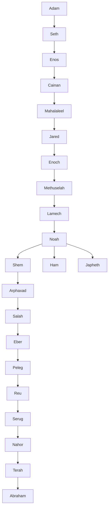
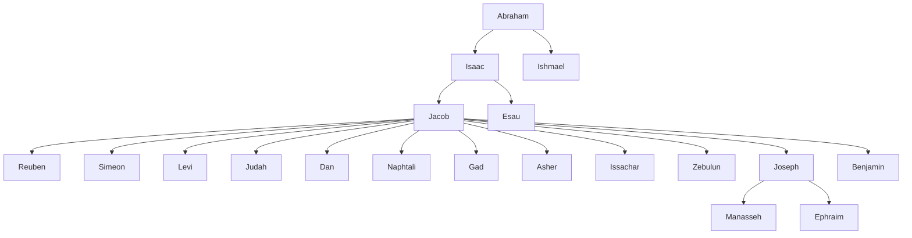

# Biblical Characters

> [!quote] "Now these things took place as examples for us, that we might not desire evil as they did." - 1 Corinthians 10:6

## Character Profiles

This section catalogs biblical figures, their relationships, and their significance in Scripture.

```dataview
TABLE WITHOUT ID
  file.link as "Character",
  time_period as "Time Period",
  significance as "Significance",
  bible_books as "Featured In"
FROM "Characters"
WHERE !contains(file.name, "Home")
SORT file.name ASC
```

## Characters by Biblical Era

```dataview
TABLE WITHOUT ID
  length(rows) as "Count",
  rows.file.link as "Characters"
FROM "Characters"
FLATTEN biblical_era as era
WHERE era
GROUP BY era
SORT era ASC
```

## Key Biblical Figures

```dataview
TABLE WITHOUT ID
  file.link as "Character",
  role as "Role",
  key_events as "Key Events"
FROM "Characters"
WHERE contains(file.tags, "key-figure")
SORT file.name ASC
```

## Family Trees

### Patriarchs


### Abraham's Family


## Biblical Character Map

```dataview
TABLE WITHOUT ID
  file.link as "Character",
  relationships as "Relationships"
FROM "Characters"
WHERE relationships
SORT file.name ASC
```

```meta-bind-button
label: 👤 New Character Profile
style: primary
class: button-indigo
actions:
- type: templaterCreateNote
  templateFile: Templates/Character.md
  folderPath: Characters
``` 